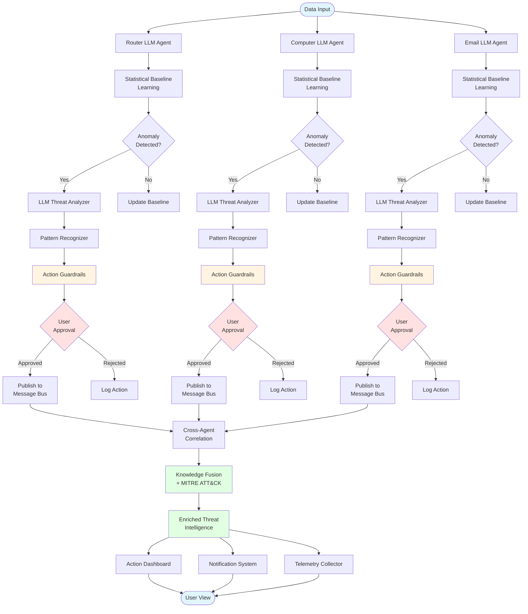
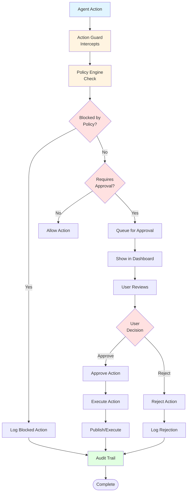
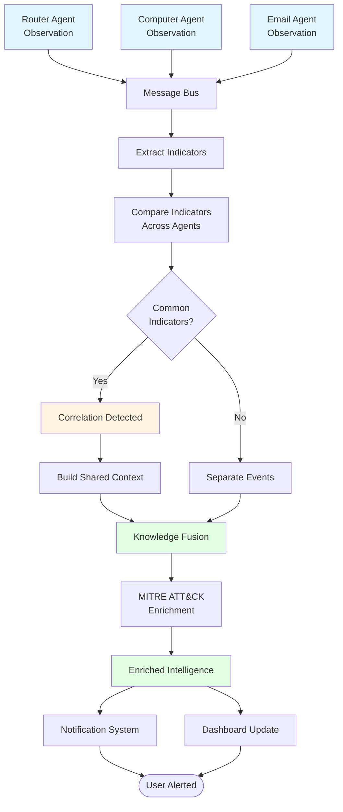
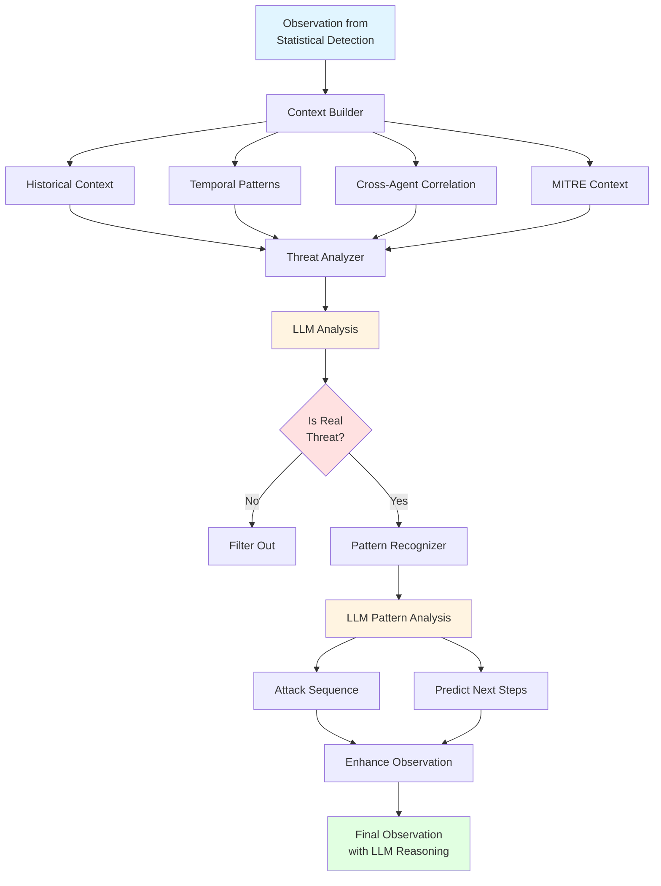
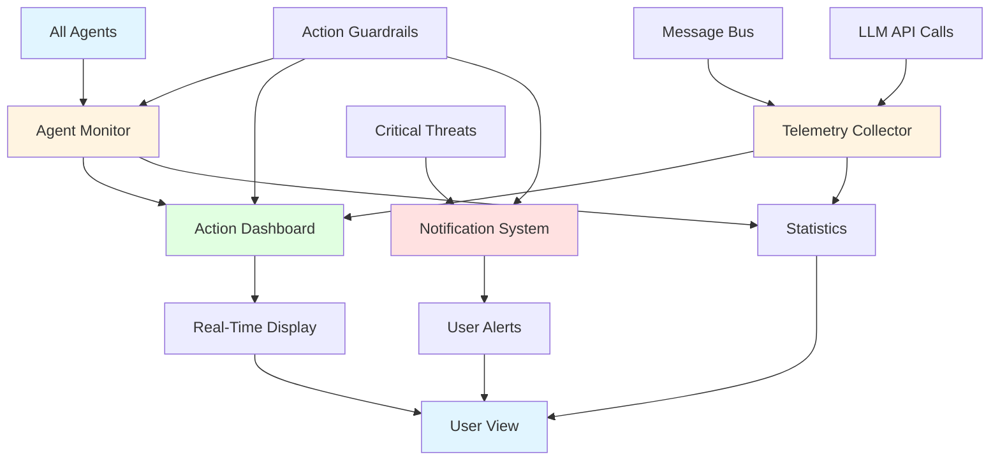
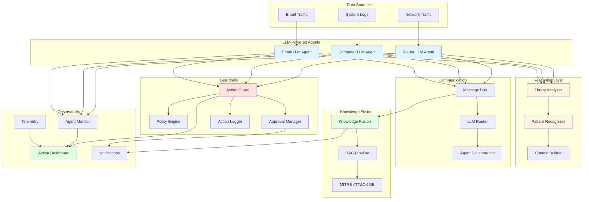

# System Architecture Flowchart

This document contains visual flowcharts showing how the modern AI-powered security agent system works.

## Main System Flow

## Agent Processing Flow (Detailed)

```mermaid
graph LR
    A[Raw Data] --> B[Extract Features]
    B --> C[Update Baselines]
    C --> D[Calculate Anomaly Scores]
    D --> E{Max Score ><br/>Threshold?}
    
    E -->|No| F[Continue Learning]
    E -->|Yes| G[Generate Initial<br/>Observation]
    
    G --> H[Build Context]
    H --> I[LLM Threat Analysis]
    I --> J{Is Real<br/>Threat?}
    
    J -->|No| F
    J -->|Yes| K[Pattern Recognition]
    
    K --> L[Enhance Observation<br/>with LLM Analysis]
    L --> M[Action Guardrails]
    M --> N{Requires<br/>Approval?}
    
    N -->|Yes| O[Queue for Approval]
    N -->|No| P[Publish Observation]
    
    O --> Q{User<br/>Approves?}
    Q -->|Yes| P
    Q -->|No| R[Log Rejection]
    
    P --> S[Message Bus]
    S --> T[Knowledge Fusion]
    
    style A fill:#e1f5ff
    style I fill:#fff4e1
    style K fill:#fff4e1
    style M fill:#ffe1e1
    style Q fill:#ffe1e1
    style T fill:#e1ffe1
```

## Guardrails & Approval Flow

## Cross-Agent Correlation Flow

## LLM Reasoning Flow

## Observability & Monitoring Flow

## Complete System Architecture

